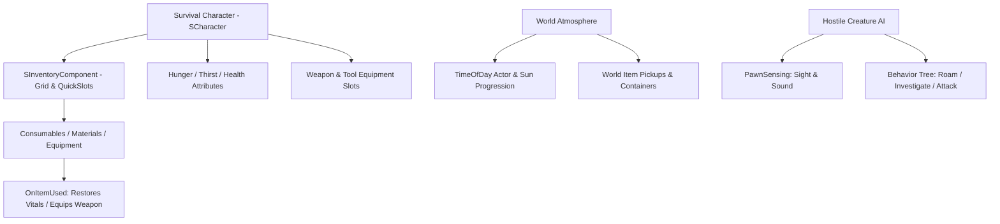

# Survival Game Framework — WebSpider Studios


**Survival Game Framework** is a 3rd-person multiplayer survival game architecture developed and extended by **WebSpider Studios (Vivekanand Rajbhar)**, built for Unreal Engine.

Featuring a robust inventory system, equipment handling, dynamic hunger/thirst/stamina vitals, full day/night time progression, and hostile AI bot perception, this framework provides an enterprise base for open-world survival prototypes.

---

## 🌲 Survival Mechanics Architecture



### 1. Survival Vitals & Metabolism
* **Attributes**: Dynamic calculation of Hunger, Thirst, Stamina, Health, and Oxygen levels.
* **Depletion Loops**: Natural decay curves adjusted by movement states (sprinting, swimming, resting).
* **Afflictions**: Starvation, dehydration, and fall damage debuffs with visual HUD warning indicators.

### 2. Inventory & Equipment Management
* **Grid Inventory**: Capacity-limited weight and slot inventory system with drag-and-drop replication.
* **Item Types**: Consumables (food, water, medicine), crafting resources, tools, and weapons.
* **Equippable Weapons**: Rifle and shotgun firearm handling with ammo pooling and muzzle sockets.

### 3. Environment & Enemy AI
* **Dynamic Time of Day**: Real-time celestial rotation, directional light transition, and ambient night lighting.
* **Hostile Zombie AI**: Sensor-driven creature AI reacting to flashlight beams, footsteps, and gunshots with Behavior Trees.
* **Interactable World**: Pickup containers, consumable plants, and loot chests with replicated state persistence.

---

## 🛠️ How to Build and Run in Unreal Engine

### Prerequisites
* **Unreal Engine**: 5.8 or 5.7 installed via Epic Games Launcher
* **IDE**: Visual Studio 2022 (with *Game Development with C++* workload)
* **OS**: Windows 10/11 (64-bit)

### Steps
1. Clone this repository:
   ```bash
   git clone https://github.com/VR-WebSpider/SurvivalGameFramework.git
   ```
2. Right-click `SurvivalGame.uproject` and select **Generate Visual Studio project files**.
3. Open `SurvivalGame.sln` in Visual Studio 2022.
4. Set the build configuration to **Development Editor** and platform to **Win64**.
5. Launch the editor (F5 or double-click `SurvivalGame.uproject`).
6. Open `/Game/Maps/CoopLandscape_Map` to test multiplayer survival mechanics and AI loops.

---

## 🏢 Credits & Attribution

* Developed and extended by **WebSpider Studios (Vivekanand Rajbhar)**.
* Built upon foundational survival game architecture created by **Tom Looman**. Licensed under the [MIT License](LICENSE).
